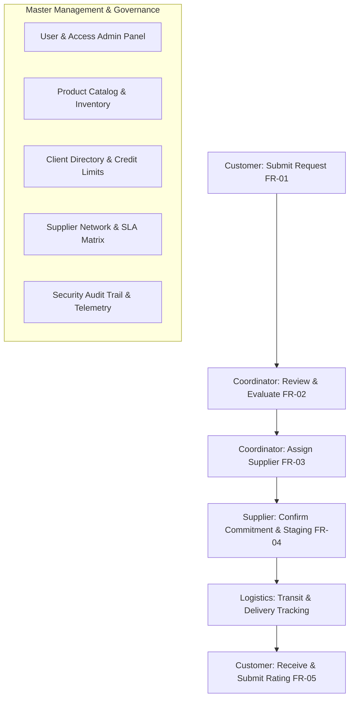

# VIPER Supply Chain Management (SCM) System
## Enterprise Multi-Portal Platform & Quality Engineering Suite

**Project:** VIPER SCM Platform (Ejada Case Study)  
**Academic Course:** SE3002 Software Quality Engineering  
**Architecture:** React 18 + Vite + Tailwind CSS + Supabase PostgreSQL (with Offline LocalStorage Engine)  
**Status:** **Production Ready (v1.0)**

---

## 📌 Executive Summary

**VIPER SCM** is a full-featured, enterprise-grade Supply Chain Management platform designed for the Ejada Company. It digitizes the complete procurement lifecycle across three distinct operational domains: **SCM Coordinators**, **Tier-1 Suppliers**, and **Corporate Clients/Customers**.

The platform is backed by a dual-mode data architecture (Live Cloud Supabase PostgreSQL + Local-First offline persistence) and includes a comprehensive Quality Engineering suite (SonarQube analysis, 25+ functional test cases, Jira defect reports, and viva defense documentation).

---

## 👥 System Access & User Credentials

The system authenticates against real enterprise records in the database. Use the credentials below to access any of the three operational portals:

### 🏛️ 1. SCM Coordinators (Operations & Dispatch Domain)
Full authority over client accounts, product catalog, supplier network, request routing, logistics manifests, and user access provisioning.

| Username | Password | Full Name | Official Role Title | Email |
| :--- | :--- | :--- | :--- | :--- |
| `coordinator` | `admin123` | **Ahmed Al-Mansour** | Director of SCM Operations & Dispatch | `ahmed.mansour@ejada.com` |
| `sara.coord` | `admin123` | **Sara Al-Husseini** | Senior Logistics Dispatch Officer | `sara.husseini@ejada.com` |

---

### 🚚 2. Tier-1 Certified Suppliers (Fulfillment & Delivery Domain)
Dedicated workspace to inspect allocated supply orders, stage warehouse inventory, register delivery commitments, and monitor SLA performance.

| Username | Password | Supplier Organization | Specialty / Procurement Domain | Contact Email |
| :--- | :--- | :--- | :--- | :--- |
| `dell.supp` | `supp123` | **Dell Enterprise Middle East** | Rack Servers, Blades & Cloud Infrastructure | `enterprise-orders@dell.com.sa` |
| `cisco.supp` | `supp123` | **Cisco Systems Gulf LLC** | Core Routing, Firewalls & Security Appliances | `scm-fulfill@cisco.com` |
| `oracle.supp` | `supp123` | **Oracle Saudi Arabia** | Enterprise Database & Middleware Licenses | `middleware-sales@oracle.com.sa` |
| `supplier1` | `supp123` | **TechCorp Hardware Solutions** | Tier-1 Certified Hardware Logistics | `dispatch@techcorp-sa.com` |

---

### 🏢 3. Corporate Clients / Customers (Procurement & Orders Domain)
Interactive procurement portal for corporate clients to browse certified hardware, submit supply requests, check credit line limits, and track 5-stage shipment milestones.

| Username | Password | Client Enterprise | Department / Contact Person | Email |
| :--- | :--- | :--- | :--- | :--- |
| `customer1` | `cust123` | **Ejada IT Enterprise** | Fahad Al-Mutawa (Procurement Lead) | `fahad.mutawa@ejada.com` |
| `aramco.cust` | `cust123` | **Saudi Aramco Services Group** | Tariq Al-Otaibi (Infrastructure Lead) | `procurement@aramco-services.com` |
| `rajhi.cust` | `cust123` | **Al-Rajhi Financial Corp** | Sarah Al-Ghamdi (IT Operations VP) | `systems@alrajhi-corp.com` |
| `stc.cust` | `cust123` | **STC Digital Infrastructure** | Khalid Al-Dossary (Datacenter Modernization) | `datacenter@stc.com.sa` |

---

## 🏛️ Portal Architecture & Features



### 1. Coordinator Portal (10 Modules)
* **Dashboard Overview:** Executive KPI summary, live pending requests, and fast-action shortcuts.
* **User & Access Admin:** Provision new user accounts directly to the live database, edit roles, and manage permissions.
* **Supply Requests:** Complete request lifecycle management, approval/rejection workflows, and supplier allocation modal.
* **Client Directory:** Corporate client profiles, contact directory, and credit limit allocations.
* **Product Catalog:** Certified enterprise hardware items, unit pricing, stock levels, and reorder alerts.
* **Supplier Network:** Tier-1 vendor profiles, specialty categories, and performance ratings.
* **Analytics & Reports:** Pipeline financial valuations, status distributions, and SLA metrics.
* **Security Audit Trail:** Transaction telemetry, execution latencies, and payload tracking.
* **Logistics & Dispatch:** Carrier fleet tracking, manifest schedules, and transit milestones.
* **SLA & Contracts:** Master vendor SLA matrix, breach rates, and response time benchmarks.

### 2. Supplier Portal (7 Modules)
* **Supplier Overview:** Allocation metrics, active orders, and fulfillment throughput.
* **Supply Requests:** Allocated order commitments, staging dates, and status transitions.
* **Delivery Schedule:** Weekly dispatch timeline and staging deadlines.
* **Alerts & Updates:** Real-time broadcast alerts and coordinator instructions.
* **Fulfillment History:** Past fulfilled orders, performance ratings, and archived dispatches.
* **Staging & Warehouse:** Buffer inventory, staging bays, and ready-to-ship stock levels.
* **Partner SLA Terms:** Contractual turnaround thresholds, defect tolerances, and compliance scorecards.

### 3. Customer Portal (6 Modules)
* **My Supply Requests:** Active supply orders, status badges, and feedback reviews.
* **Submit New Request:** Interactive request creation with real-time budget and credit verification.
* **Corporate Account:** Corporate profile, credit line utilization, and account status.
* **Invoices & Archives:** Itemized order history, billing invoices, and fulfillment dates.
* **Browse IT Catalog:** Searchable enterprise hardware catalog with price listings and specifications.
* **Order Tracking:** 5-stage shipment progress tracker (*Submitted $\rightarrow$ Evaluated $\rightarrow$ Allocated $\rightarrow$ In Transit $\rightarrow$ Delivered*).

---

## 🕹️ Interactive Error 404 & SCM Runner Game

* **Supply Route Disconnected (404):** Custom 404 page featuring an interactive **VIPER Express Highway Runner** game (inspired by Chrome's offline Dino game).
* **Game Features:**
  * Control a VIPER Express Delivery Truck dodging cargo crates and server rack obstacles.
  * Controls: `SPACEBAR`, `▲ UP ARROW`, or canvas click to jump.
  * Real-time score counter and all-time High Score persisted to `localStorage`.
  * Accessible from the sidebar via the **"404 Route Game"** button.

---

## 🛠️ Technology Stack & Setup

### Core Technologies
* **Frontend:** React 18, Vite 6, Tailwind CSS
* **Icons:** Lucide React
* **Database:** Supabase PostgreSQL (Cloud) + Local-First Offline Storage Fallback
* **Code Quality:** SonarQube Scanner configuration (`sonar-project.properties`)

---

### Local Installation & Running

```bash
# 1. Clone repository
git clone https://github.com/tlhaasami/<YOUR_REPOSITORY_NAME>.git
cd <YOUR_REPOSITORY_NAME>

# 2. Install dependencies
npm install

# 3. Start local development server
npm run dev
```

Open your browser at `http://localhost:3000/`.

---

### 🌐 Cloud Database Configuration (`.env`)

To connect to your live Supabase cloud database, configure `.env`:

```env
VITE_SUPABASE_URL=https://<YOUR_PROJECT_REF>.supabase.co
VITE_SUPABASE_ANON_KEY=<YOUR_SUPABASE_ANON_KEY>
```

---

## 📂 Quality Engineering Documentation Suite

All formal SE3002 assignment deliverables are available in the [`report/`](file:///e:/University/SQE/report) directory:

1. **[`01_REQUIREMENTS_AND_ASSUMPTIONS.md`](file:///e:/University/SQE/report/01_REQUIREMENTS_AND_ASSUMPTIONS.md):** 8 Functional & 4 Non-Functional Requirements breakdown and AI assumptions.
2. **[`02_BASELINE_SYSTEM_DOCUMENTATION.md`](file:///e:/University/SQE/report/02_BASELINE_SYSTEM_DOCUMENTATION.md):** Architecture model, data access layers, and deployment setup.
3. **[`03_SONARQUBE_ANALYSIS_AND_NFR_EVALUATION.md`](file:///e:/University/SQE/report/03_SONARQUBE_ANALYSIS_AND_NFR_EVALUATION.md):** Static code analysis interpretations, quality gate benchmarks, and NFR validation.
4. **[`04_FUNCTIONAL_TESTING_AND_TRACEABILITY.md`](file:///e:/University/SQE/report/04_FUNCTIONAL_TESTING_AND_TRACEABILITY.md):** Test matrix (25+ test cases), execution logs, and RTM traceability.
5. **[`05_JIRA_DEFECT_REPORTS_AND_QUALITY_JUDGMENT.md`](file:///e:/University/SQE/report/05_JIRA_DEFECT_REPORTS_AND_QUALITY_JUDGMENT.md):** Jira defect reports, severity ratings, and final software release judgment.
6. **[`06_VIVA_PREPARATION_AND_DEFENSE_GUIDE.md`](file:///e:/University/SQE/report/06_VIVA_PREPARATION_AND_DEFENSE_GUIDE.md):** Defense questions, evaluator Q&A cheatsheet, and rubric checklist.

---

## 📄 License
Academic & Enterprise Case Study — Ejada Company Supply Chain Management System.
