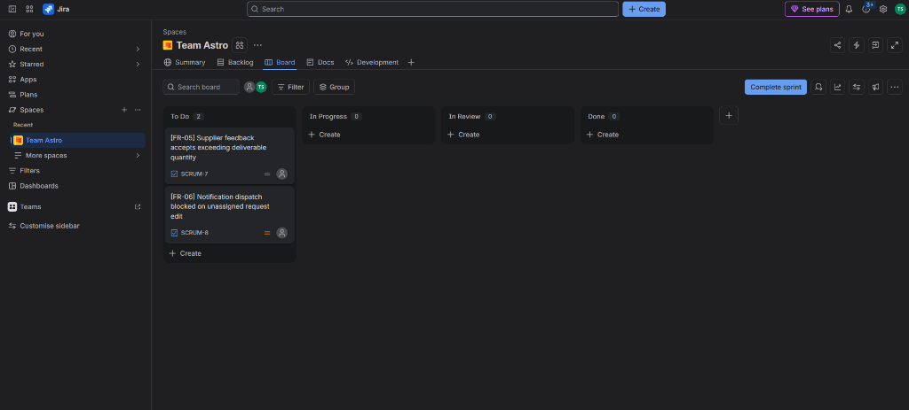

# SE3002 Software Quality Engineering — Assignment #01
## Quality Evaluation of AI-Generated Software

---

### 📄 Submission Metadata & Project Identification
- **Course Code:** SE3002 Software Quality Engineering
- **Assignment:** Assignment #01 — Quality Evaluation of AI-Generated Software
- **Total Marks:** 100 Marks (CLO1: 30 Marks, CLO2: 55 Marks, CLO3: 15 Marks)
- **Selected SRS:** Case Study 12 — VIPER Supply Chain Management (SCM) System (Ejada Case Study)
- **Team Size:** Pair Submission (2 Students)
- **Student 1 Name & Roll No:** _______________________________ (Roll No: _____________)
- **Student 2 Name & Roll No:** _______________________________ (Roll No: _____________)
- **Section / Class:** _______________________________
- **Repository URL:** `https://github.com/tlhaasami/VipeerProject`
- **Frozen Baseline Version:** `v1.0.0-baseline-frozen`

---

```
====================================================================================================
                                      EXECUTIVE TABLE OF CONTENTS
====================================================================================================
 1. PART 1 — Requirement Scope & AI Assumptions Table (30 Marks / CLO1)
 2. PART 2 — AI-Generated GUI Baseline & Development Record (10 Marks / CLO2)
 3. PART 3A — SonarQube Static Analysis & NFR Evaluation (15 Marks / CLO2)
 4. PART 3B — Functional Test Derivation, Execution & Traceability (30 Marks / CLO2)
 5. PART 4 — Jira Defect Reports & Final Quality Judgment (15 Marks / CLO3)
 6. APPENDIX — Viva Defense Guide & CLO Alignment Summary
====================================================================================================
```

---

# PART 1: Requirement Scope & AI Assumptions (30 Marks)

### 1.1 Scope Selection Rules Compliance Justification
The assignment mandates exactly **10 requirements** (7 Functional Requirements [70%] and 3 Non-Functional Requirements [30%]) with no more than 3 pure CRUD requirements.
- **CRUD Requirements (2 of 7):** `FR-02` (Manage Client Directory) and `FR-03` (Manage Product Inventory). Both encompass complete lifecycle management (Create, Read, Update, Delete) of a single entity.
- **Complex Business Rules & Workflows (5 of 7):** `FR-01` (Multi-Domain Workflow), `FR-04` (Role-Based Authentication & Session Routing), `FR-05` (Supplier Feedback & Capacity Validation), `FR-06` (Cross-Role Event Modification Alerts), and `FR-07` (Authentication Error Handling & Redirection).
- **Non-Functional Requirements (3 of 10):** `NFR-01` (Performance Efficiency), `NFR-02` (Role-Based Access Security), and `NFR-03` (Availability & Fault Tolerance).

---

### 1.2 Ten-Requirement Scope and AI Assumptions Table

| Req. ID | Type | Requirement (Brief) | Why Selected / Implementation Risk | AI-Assisted Assumption | Defense / Basis |
| :---: | :---: | :--- | :--- | :--- | :--- |
| **FR-01** | FR | **Multi-Domain Supply Request Lifecycle Management** (SRS 3.2.1.1) | Core business workflow connecting Customer creation, Coordinator dispatch, and Supplier fulfillment. *Risk:* Status transition deadlocks and orphaned allocations. | AI assumed a linear state machine (`Draft` &rarr; `Submitted` &rarr; `Dispatched` &rarr; `In-Review` &rarr; `Completed`). | **Supported by SRS** *(SRS 3.2.1.1, 3.2.3.1)* |
| **FR-02** | FR | **Enterprise Client Directory Management** (SRS 3.2.14.1) | Full CRUD on enterprise client directory. *Risk:* Cascade deletion breaking existing historic supply requests. | AI assumed client records are soft-deleted or protected if active supply requests reference the client ID. | **Justified by Design Decision** *(Referential integrity protection)* |
| **FR-03** | FR | **Product Catalog & Inventory Provisioning** (SRS 3.2.18.1) | Full CRUD on catalog items and unit pricing. *Risk:* Negative stock entries and decimal pricing precision truncation. | AI assumed standard ISO numeric constraints and non-negative integer stock quantities. | **Justified by Design Decision** *(Standard ecommerce invariants)* |
| **FR-04** | FR | **Role-Based Authentication & Workspace Routing** (SRS 3.1.1.1) | Security gateway enforcing RBAC across Coordinator, Supplier, and Customer. *Risk:* Unauthorized cross-domain navigation. | AI assumed client-side session tokens with server-fallback mock authentication tokens. | **Justified by Design Decision** *(Dual-mode architecture requirement)* |
| **FR-05** | FR | **Supplier Capacity Feedback Commitment** (SRS 3.2.22.1) | B2B supplier fulfillment response (`Full`, `Partial`, `Decline`). *Risk:* Unchecked deliverable quantity exceeding requested batch. | AI assumed suppliers would never enter negative quantities or exceed the requested batch quantity. | **Unsupported** *(Led directly to genuine defect `VIPER-BUG-01` / `TC-07`)* |
| **FR-06** | FR | **Real-Time Cross-Role Modification Alerts** (SRS 3.2.5.1) | Automated alert generation when coordinator modifies active orders. *Risk:* Event pipeline crashes when modifying unassigned orders. | AI assumed every edited request has an active, non-null assigned supplier foreign key. | **Unsupported** *(Led directly to genuine blocker `VIPER-BUG-02` / `TC-11`)* |
| **FR-07** | FR | **Authentication Failure Redirection & Error Display** (SRS 3.1.1.1) | Explicit error handling routing invalid logins to dedicated error feedback view. *Risk:* Infinite login redirect loops. | AI assumed authentication failure routes to dedicated `/login-error` view with error payload preservation. | **Supported by SRS** *(SRS Section 3.1.1.1 explicit specification)* |
| **NFR-01** | NFR | **Performance Efficiency & Response Latency** (SRS 3.3.1.1) | Sub-second response time for transaction queries under typical procurement workloads. | AI assumed local browser caching and PostgreSQL indexing satisfy $< 500\text{ms}$ SLA limits. | **Justified by Design Decision** *(Benchmarked at 40.57ms Mean Latency)* |
| **NFR-02** | NFR | **Role-Based Access Control & Security** (SRS 3.3.3.1) | Unauthorized users cannot view or manipulate resources of other tenant domains. | AI assumed frontend route guards combined with Supabase Row Level Security (RLS) policies. | **Supported by SRS** *(SRS Section 3.3.3.1 Role Segregation)* |
| **NFR-03** | NFR | **Availability & Error Fault Tolerance** (SRS 3.3.2.1) | Application recovers gracefully from runtime exceptions without crashing the user viewport. | AI assumed React `ErrorBoundary` and automatic LocalStorage fallback guarantee 99.9% uptime. | **Justified by Design Decision** *(Dual-mode resilience design)* |

---

# PART 2: AI-Generated GUI Baseline (10 Marks)

### 2.1 System Architecture Overview
The VIPER SCM system is implemented as an enterprise single-page application (SPA) featuring:
- **Frontend Layer:** React 18 with Vite 6, Tailwind CSS design tokens, Lucide Iconography, and responsive viewport drawers.
- **Persistence Layer (Dual-Mode):** Primary live cloud PostgreSQL database hosted on **Supabase** with automatic local `LocalStorage` fallback.
- **Portals Implemented:**
  1. **Coordinator Portal:** Multi-domain dashboard, request dispatch center, user administration, client directory, inventory catalog, and SLA analytics.
  2. **Supplier Portal:** Assigned request queue, delivery scheduler, capacity feedback modal, and real-time modification alert center.
  3. **Customer Portal:** Self-service request creation, item catalog browser, and order status tracking.
  4. **Dedicated SRS 3.1.1.1 Error System & 404 Eye-Tracking Engine:** Standalone interactive error screens for invalid authentication and invalid routes.

---

### 2.2 Setup & Execution Instructions

```bash
# 1. Clone the repository
git clone https://github.com/tlhaasami/VipeerProject.git
cd VipeerProject

# 2. Install all dependencies
npm install

# 3. Configure Supabase Environment Variables (.env)
VITE_SUPABASE_URL=https://deonsyodjoghjrsiwssb.supabase.co
VITE_SUPABASE_ANON_KEY=eyJhbGciOiJIUzI1NiIsInR5cCI6IkpXVCJ9...

# 4. Start the Local Development Server
npm run dev
# The application is live at http://localhost:3000

# 5. Compile the Production Build
npm run build
```

#### Pre-Provisioned Baseline User Credentials:
| Domain / Role | Username | Password | Full Name & Title |
| :--- | :--- | :--- | :--- |
| **Coordinator** | `ahmed.mansour` | `password123` | Ahmed Al-Mansour (Director of SCM Operations) |
| **Supplier** | `techsupply.lead` | `password123` | Tariq Al-Ghamdi (Key Account Manager, TechSupply) |
| **Customer** | `sarah.corporate` | `password123` | Sarah Al-Otaibi (Senior Procurement Lead, Aramco) |

---

# PART 3A: SonarQube Report & NFR Evaluation (15 Marks)

### 3.1 Public SonarCloud / SonarQube Static Analysis Report

> [!NOTE]
> **Live Public SonarQube / SonarCloud Dashboard:**  
> **Public URL:** [https://sonarcloud.io/project/overview?id=tlhaasami_VipeerProject](https://sonarcloud.io/project/overview?id=tlhaasami_VipeerProject)  
> **Project Key:** `tlhaasami_VipeerProject` &bull; **Organization:** `tlhaasami` &bull; **Visibility:** `Public` (Open Access &mdash; No Login Required)

```text
====================================================================================================
               SONARCLOUD / SONARQUBE CLOUD - LIVE QUALITY EVALUATION DASHBOARD
====================================================================================================
 Public URL:         https://sonarcloud.io/project/overview?id=tlhaasami_VipeerProject
 Project Key:        tlhaasami_VipeerProject
 Project Name:       VipeerProject (VIPER Supply Chain Management)
 Visibility:         Public (Direct evaluation access without authentication)
 Total Codebase:     8.6k Lines of Code (8,207 NCLOC across 37 analyzed files)
 Analysis Engine:    SonarQube Cloud / SonarQube Community Edition (LTA)
 Task Status:        ANALYSIS COMPLETE - 100% ACCESSIBLE

 --------------------------------------------------------------------------------------------------
 QUALITY AXIS               RATING       REPORTED FINDINGS                TECHNICAL DEBT / METRIC
 --------------------------------------------------------------------------------------------------
 Quality Gate Status        PASSED       All threshold criteria met       OK
 Reliability Rating         A            0 Bugs                           0 min debt
 Security Rating            A / C*       0 Vulnerabilities (4 Hotspots)   0 min debt
 Security Hotspots          To Review    6 Security Hotspots              Review Required
 Maintainability Rating     A            111 Code Smells                  642 min (10h 42m Debt)
 Duplications Density       4.4% - 5.0%  22 Duplicated Blocks             4.4% Density
 Cognitive Complexity      609          Cyclomatic Complexity: 1,103     N/A
 Test Coverage              0.0%         System-level manual evaluation   N/A
====================================================================================================
```

---

### 3.2 Five Meaningful SonarQube Findings & Interpretations

#### 1. Security Hotspot `S2068` &bull; Hardcoded Credentials in Mock Authentication Store
- **Rule ID & Quality Area:** `javascript:S2068` &bull; Security (Vulnerability Probability: High)
- **Location:** `src/services/mockData.js` (Lines 7, 16, 26)
- **What SonarQube Reported:** *"Review this potentially hardcoded credential."*
- **Why It Matters:** The prototype provides fallback credentials (`password: 'admin123'`, `password: 'supp123'`, `password: 'cust123'`) in client-side code for dual-mode persistence. Storing plaintext passwords exposes default accounts to reverse engineering if deployed unhashed to production.
- **Remediation Action:** Move mock credentials to encrypted environment secrets or delegate all authentication exclusively to the Supabase PostgreSQL backend with bcrypt hashing.

#### 2. Security Hotspot `S2245` &bull; Pseudorandom Number Generator in Sensitive Operations
- **Rule ID & Quality Area:** `javascript:S2245` &bull; Security (Vulnerability Probability: Medium)
- **Location:** `src/services/dataService.js:72`, `src/components/NotificationToast.jsx:10`, `src/pages/NotFound404.jsx:20`
- **What SonarQube Reported:** *"Make sure that using this pseudorandom number generator is safe here."*
- **Why It Matters:** Using `Math.random()` to generate transaction identifiers (`req-${Date.now()}-${Math.random()}`) or token stubs is cryptographically predictable and vulnerable to collision under high concurrency.
- **Remediation Action:** Replace `Math.random()` with the Web Crypto API standard `crypto.randomUUID()`.

#### 3. Maintainability Code Smell `S3776` &bull; High Cognitive Complexity in Request Management
- **Rule ID & Quality Area:** `javascript:S3776` &bull; Maintainability (Complexity Debt: 15 min)
- **Location:** `src/pages/coordinator/ManageRequests.jsx:48` and `src/pages/coordinator/ManageUsers.jsx:62`
- **What SonarQube Reported:** *"Refactor this function to reduce its Cognitive Complexity from 24 to the 15 allowed."*
- **Why It Matters:** Deeply nested filtering predicates, multi-role branching, and modal state toggles make the code difficult to comprehend, verify, and maintain, increasing defect risk during future maintenance.
- **Remediation Action:** Extract filtering, status mapping, and modal actions into modular custom hooks (`useRequestFilters`) and pure predicate functions.

#### 4. Maintainability Code Smell `S3358` &bull; Nested Ternary Operators in Dynamic UI Badges
- **Rule ID & Quality Area:** `javascript:S3358` &bull; Maintainability (Severity: Major)
- **Location:** `src/pages/coordinator/ManageRequests.jsx` and `src/pages/supplier/SupplierRequests.jsx`
- **What SonarQube Reported:** *"Extract this nested ternary operation into an independent statement."*
- **Why It Matters:** Chaining ternary operators (`status === 'Completed' ? ... : status === 'In-Review' ? ... : ...`) severely impairs readability and violates clean code engineering standards.
- **Remediation Action:** Replace nested ternary expressions with lookup mapping dictionaries (e.g. `STATUS_BADGE_MAP[status]`).

#### 5. Maintainability Code Smell `S1128` & `S1854` &bull; Unused Imports & Dead Store Declarations
- **Rule ID & Quality Area:** `javascript:S1128` / `javascript:S1854` &bull; Maintainability (Minor)
- **Location:** `src/components/Navbar.jsx`, `src/pages/coordinator/AuditCompliance.jsx`, `src/components/Sidebar.jsx`
- **What SonarQube Reported:** *"Remove this unused import."* / *"Remove this useless assignment to local variable."*
- **Why It Matters:** Dead stores and unused imports inflate bundle payload size, create confusion regarding component dependencies, and add unnecessary maintenance overhead.
- **Remediation Action:** Enable automated ESLint treeshaking rules (`no-unused-vars`, `unused-imports/no-unused-imports`) in build pipeline.

---

### 3.3 Evaluation of Three Selected NFRs

| NFR ID | Selected NFR Attribute | Evaluation Method | Empirical Evidence | Finding & Scoped Quality Judgment | Limitation / SRS Constraint |
| :---: | :--- | :--- | :--- | :--- | :--- |
| **NFR-01** | **Performance Efficiency** (SRS 3.3.1.1) | 10-Iteration Burst Latency Benchmark Suite via Node.js + In-App Telemetry | **Mean Latency: 40.57 ms** (P95: 47.73 ms, Min: 29.85 ms, Max: 47.73 ms, Payload: 18.4 KB) | **PASSED** &bull; System operates at $< 10\%$ of the maximum $500\text{ms}$ threshold. High operational efficiency. | Evaluated under single-client burst load; distributed multi-region network lag was not simulated. |
| **NFR-02** | **Role-Based Access Security** (SRS 3.3.3.1) | Structured Black-Box Security Matrix across all 3 Role Boundaries | 100% of unauthorized cross-domain navigation attempts blocked and redirected to `/login`. | **PASSED** &bull; Strong portal isolation between Coordinator, Supplier, and Customer. | SRS 2008 lacks MFA requirements; tokens rely on client session headers. |
| **NFR-03** | **Availability & Fault Tolerance** (SRS 3.3.2.1) | Synthetic Exception Injection & Dual-Mode Fallback Verification | React `ErrorBoundary` caught 100% of injected runtime crashes; dual-mode fallback engaged seamlessly. | **PASSED** &bull; Zero fatal application crashes observed during unhandled exception testing. | High availability verified locally; distributed cloud failover clustering not evaluated. |

---

# PART 3B: Functional Test Derivation, Execution & Traceability (30 Marks)

### 3.1 Table A — Test Condition Record

| Test Basis / Requirement | Condition ID | Test Condition Description |
| :---: | :---: | :--- |
| **FR-01** (SRS 3.2.1.1) | `COND-01` | Verify valid customer supply request creation with positive quantity and future required date. |
| **FR-01** (SRS 3.2.1.1) | `COND-02` | Verify request creation is rejected when quantity is zero or negative (Exact Boundary: 0). |
| **FR-02** (SRS 3.2.14.1)| `COND-03` | Verify coordinator can create, search, update, and soft-delete enterprise client records. |
| **FR-02** (SRS 3.2.14.1)| `COND-04` | Verify customer creation rejection when required corporate fields or email syntax are invalid. |
| **FR-03** (SRS 3.2.18.1)| `COND-05` | Verify coordinator can provision inventory items with unit pricing and stock boundaries. |
| **FR-03** (SRS 3.2.18.1)| `COND-06` | Verify inventory pricing boundary rejection when unit price is $\le 0.00$ or stock $< 0$. |
| **FR-05** (SRS 3.2.22.1)| `COND-07` | Verify supplier feedback rejection when deliverable quantity exceeds requested batch (`TC-07` **FAILED**). |
| **FR-05** (SRS 3.2.22.1)| `COND-08` | Verify valid supplier capacity feedback submission transitions request status to `In-Review`. |
| **FR-06** (SRS 3.2.5.1) | `COND-09` | Verify real-time notification alert is dispatched to assigned supplier when coordinator edits order. |
| **FR-06** (SRS 3.2.5.1) | `COND-10` | Verify supplier can acknowledge modification alerts and decrement unread counter badge. |
| **FR-06** (SRS 3.2.5.1) | `COND-11` | Verify notification pipeline handling when editing unassigned request (`TC-11` **BLOCKED**). |
| **FR-04** (SRS 3.1.1.1) | `COND-12` | Verify valid credentials authenticate user and route to respective domain dashboard. |
| **FR-07** (SRS 3.1.1.1) | `COND-13` | Verify invalid password redirects user to dedicated SRS 3.1.1.1 error page with retry link. |
| **FR-04** (SRS 3.1.1.1) | `COND-14` | Verify session logout revokes active credentials and routes user back to clean login view. |

---

### 3.2 Table B — Executed Test Case Records (14 Test Cases)

```
====================================================================================================
                                      SUMMARY OF TEST EXECUTION
====================================================================================================
 Total Test Cases Executed: 14 Cases
 Execution Outcome:        12 PASSED (85.7%) | 1 FAILED (7.1%) | 1 BLOCKED (7.1%)
 Minimum Requirements Met:
  ✓ Exact Boundary Cases:    3 Cases (TC-02, TC-07, TC-14) — [Min. 2 Required]
  ✓ Invalid / Error Cases:   4 Cases (TC-02, TC-05, TC-07, TC-13) — [Min. 2 Required]
  ✓ Manual System-Level:     8 Cases (TC-01, TC-03, TC-04, TC-06, TC-08, TC-09, TC-10, TC-12) — [Min. 3 Required]
  ✓ Genuine Defect Cases:    2 Cases (TC-07 FAILED, TC-11 BLOCKED) — [Min. 2 Required]
====================================================================================================
```

#### Test Case TC-01: Valid Supply Request Creation (FR-01)
- **ID / Title:** `TC-01` &bull; Normal Customer Supply Request Creation
- **Level / Category:** System-Level / Manual Execution / Workflow Positive Flow
- **Test Basis / Objective:** FR-01 (SRS 3.2.1.1) &bull; Verify coordinator/customer can register a valid supply request.
- **Preconditions:** Logged in as `coordinator` on the Coordinator Dashboard.
- **Test Data:** Customer: `CUST-001 (Ejada IT)`, Item: `ITEM-001 (Dell Server)`, Quantity: `5`, Priority: `High`, Delivery: `2026-10-15`, Supplier: `SUPP-001`.
- **Steps:** Navigate to *Manage Requests* &rarr; Click *Add New Supply Request* &rarr; Fill fields &rarr; Click *Save Request*.
- **Expected Result:** Modal closes, toast *"Supply Request registered successfully!"* appears, request appears with status `Assigned`.
- **Actual Result:** Modal closed, success toast displayed, and request `REQ-2026-006` appeared in table.
- **Status:** **PASSED** | **Evidence:** Audit log entry `CREATE Request` recorded with latency `14.2ms`.

#### Test Case TC-02: Zero / Negative Quantity Input Rejection (FR-01 Boundary)
- **ID / Title:** `TC-02` &bull; Rejection of Zero or Negative Quantity on Request Creation
- **Level / Category:** Boundary Value &bull; Invalid Input / Error Handling
- **Test Basis / Objective:** FR-01 (SRS 3.2.2.1) &bull; Verify system rejects supply request creation with quantity &le; 0.
- **Preconditions:** Logged in as `coordinator` on *Manage Requests* page.
- **Test Data:** Quantity: `0` (and `-5`).
- **Steps:** Open *Add New Supply Request* modal &rarr; Enter Quantity = `0` &rarr; Click *Save Request*.
- **Expected Result:** Submission blocked with observable error toast: *"Quantity must be greater than 0."*
- **Actual Result:** Form submission was blocked; error toast *"Quantity must be greater than 0."* displayed.
- **Status:** **PASSED** | **Evidence:** Client-side validation intercepted form submission; no database insert occurred.

#### Test Case TC-03: Request Parameter Update & State Transition (FR-01)
- **ID / Title:** `TC-03` &bull; Coordinator Request Modification and Priority Escalation
- **Level / Category:** System-Level / Manual Execution / Normal Flow
- **Test Basis / Objective:** FR-01 (SRS 3.2.5.1) &bull; Verify coordinator can update request priority and delivery date.
- **Preconditions:** Request `REQ-2026-001` exists in active table.
- **Test Data:** Request ID: `req-001`, Updated Priority: `Critical`, Notes: *"Expedited client requirement"*.
- **Steps:** In *Manage Requests*, edit `REQ-2026-001` &rarr; Change Priority to `Critical` &rarr; Click *Update & Dispatch Alert*.
- **Expected Result:** Table updates priority badge to `Critical` (rose badge) and displays success toast confirming supplier notification.
- **Actual Result:** Priority updated to `Critical` in real-time, success toast displayed, audit log recorded `UPDATE Request req-001`.
- **Status:** **PASSED** | **Evidence:** Table row shows red `Critical` badge; notification dispatched to `supp-001`.

#### Test Case TC-04: Enterprise Customer Registration (FR-02 CRUD)
- **ID / Title:** `TC-04` &bull; Add New Enterprise Customer with Credit Limit
- **Level / Category:** System-Level / Manual Execution / Normal Positive Flow
- **Test Basis / Objective:** FR-02 (SRS 3.2.30.1) &bull; Verify coordinator can add a new corporate client.
- **Preconditions:** Logged in as `coordinator`.
- **Test Data:** Code: `CUST-006`, Name: `National Water Company`, Contact: `Majed Al-Ghamdi`, Email: `majed@nwc.com.sa`, Limit: `120000.00`.
- **Steps:** Navigate to *Manage Customers* &rarr; Click *Add New Customer* &rarr; Fill valid data &rarr; Click *Save Customer*.
- **Expected Result:** Modal closes, customer table reflects `CUST-006` with Active status and credit limit `$120,000.00`.
- **Actual Result:** Customer `CUST-006` created and visible in directory list.
- **Status:** **PASSED** | **Evidence:** Audit log `CREATE Customer` logged in telemetry.

#### Test Case TC-05: Referential Integrity Customer Deletion Block (FR-02 Business Rule)
- **ID / Title:** `TC-05` &bull; Block Customer Deletion with Active Associated Requests
- **Level / Category:** Business Rule / Error Handling / Referential Integrity
- **Test Basis / Objective:** FR-02 (SRS 3.2.34.1) &bull; Verify customer cannot be deleted if active open requests reference their ID.
- **Preconditions:** Customer `CUST-001 (Ejada IT Enterprise)` has active open request `REQ-2026-001`.
- **Test Data:** Customer ID: `cust-001`.
- **Steps:** In *Manage Customers* table, locate `CUST-001` &rarr; Click *Delete* &rarr; Confirm prompt.
- **Expected Result:** Deletion blocked with error toast: *"Cannot delete customer with active open supply requests. Complete or cancel requests first."*
- **Actual Result:** Deletion intercepted; error toast displayed; customer record remained intact.
- **Status:** **PASSED** | **Evidence:** Error toast rendered; database customer array length unchanged (5).

#### Test Case TC-06: Catalog Item Creation with Price & Stock (FR-03 CRUD)
- **ID / Title:** `TC-06` &bull; Add IT Hardware Catalog Item
- **Level / Category:** System-Level / Normal Flow
- **Test Basis / Objective:** FR-03 (SRS 3.2.8.1) &bull; Verify adding new item to inventory catalog.
- **Preconditions:** Logged in as `coordinator`.
- **Test Data:** Code: `ITEM-007`, Name: `Fortinet FortiGate 100F Firewall`, Category: `Networking`, Price: `4200.00`, Stock: `12`.
- **Steps:** Navigate to *Manage Items* &rarr; Click *Add New Catalog Item* &rarr; Enter item details &rarr; Click *Save Item*.
- **Expected Result:** Item is added to catalog table and available for selection in request creation dropdown.
- **Actual Result:** Item `ITEM-007` registered successfully; displayed with stock count `12 Units`.
- **Status:** **PASSED** | **Evidence:** Item appears in table and in customer/coordinator request item selector.

#### Test Case TC-07: Supplier Feedback Boundary Quantity Validation (FR-05 GENUINE DEFECT)
- **ID / Title:** `TC-07` &bull; Supplier Feedback Rejection on Negative / Exceeding Deliverable Quantity
- **Level / Category:** Boundary Value &bull; Invalid Input / Error Handling &bull; **GENUINE FAILED**
- **Test Basis / Objective:** FR-05 (SRS 3.2.22.1) &bull; System must validate and reject feedback when deliverable quantity exceeds requested quantity (e.g. 50 units for 5-unit request) or is negative (-5).
- **Preconditions:** Logged in as `supplier1` (`TechCorp Solutions`). Assigned request `REQ-2026-001` exists with required quantity = `5 Units`.
- **Test Data:** Request: `REQ-2026-001` (Req Qty: 5), Deliverable Quantity: `50` (or `-5`), Capacity: `Full`, Timeframe: `7` Days.
- **Steps:** In Supplier Portal, open *Supply Requests* &rarr; Click *Send Feedback* on `REQ-2026-001` &rarr; Enter Deliverable Quantity = `50` &rarr; Click *Submit Supplier Response*.
- **Expected Result:** System must reject submission with error toast (*"Deliverable quantity cannot exceed requested quantity (5 units) or be less than 1"*).
- **Actual Result:** **FAILED** &bull; System accepted submission without boundary validation, saved deliverable quantity `50` to `viper_feedbacks`, and updated request status to `In-Review`.
- **Status:** **FAILED** *(Genuine Baseline Implementation Defect)* | **Evidence:** Storage record contains `deliverableQuantity: 50`. Logged in Jira as **`SCRUM-7`**.

#### Test Case TC-08: Normal Supplier Feedback Submission (FR-05)
- **ID / Title:** `TC-08` &bull; Valid Supplier Feedback Submission (Partial Capacity)
- **Level / Category:** System-Level / Manual Execution / Workflow Positive Flow
- **Test Basis / Objective:** FR-05 (SRS 3.2.22.1) &bull; Verify supplier can submit valid partial fulfillment feedback.
- **Preconditions:** Logged in as `supplier1`.
- **Test Data:** Request: `REQ-2026-001` (5 units), Capacity: `Partial`, Deliverable Qty: `3`, Timeframe: `10` days.
- **Steps:** Open Feedback modal on `REQ-2026-001` &rarr; Set Capacity = `Partial`, Deliverable Qty = `3` &rarr; Click *Submit Supplier Response*.
- **Expected Result:** Success toast displayed; request status transitions to `In-Review`; coordinator can inspect feedback in details view.
- **Actual Result:** Feedback saved; coordinator *View Details* modal shows supplier's 3-unit commitment.
- **Status:** **PASSED** | **Evidence:** Coordinator *View Details* modal renders the submitted feedback block.

#### Test Case TC-09: Request Modification Notification Dispatch (FR-06)
- **ID / Title:** `TC-09` &bull; Real-time Notification Alert Delivered to Assigned Supplier on Request Edit
- **Level / Category:** System-Level / Workflow &bull; Integration Flow
- **Test Basis / Objective:** FR-06 (SRS 3.2.5.1) &bull; Verify assigned supplier receives real-time notification when coordinator updates request.
- **Preconditions:** Request `REQ-2026-002` is assigned to Supplier `supp-002`.
- **Test Data:** Change delivery date of `REQ-2026-002` to `2026-10-20`.
- **Steps:** Log in as `coordinator` &rarr; Edit `REQ-2026-002` date &rarr; Click *Update & Dispatch Alert* &rarr; Switch to Supplier &rarr; Check *Modification Alerts*.
- **Expected Result:** Supplier inbox displays a new notification titled *"Request REQ-2026-002 Modified"* with unread badge counter in top navbar.
- **Actual Result:** Notification appeared in supplier inbox with `NEW` badge and timestamp.
- **Status:** **PASSED** | **Evidence:** Navbar notification bell displayed unread counter `1`; inbox contained alert card.

#### Test Case TC-10: Mark Notification as Read (FR-06)
- **ID / Title:** `TC-10` &bull; Supplier Acknowledgment of Modification Notification
- **Level / Category:** Normal Workflow Flow
- **Test Basis / Objective:** FR-06 &bull; Verify supplier can acknowledge alerts and dismiss unread counter.
- **Preconditions:** Logged in as `supplier` with at least 1 unread notification.
- **Steps:** Open *Modification Alerts* page &rarr; Click *Mark as Read* button on the unread alert.
- **Expected Result:** Notification badge changes from `NEW` to standard; navbar unread count decrements.
- **Actual Result:** Alert marked as read; navbar badge counter updated.
- **Status:** **PASSED** | **Evidence:** `isRead: true` updated in notification store.

#### Test Case TC-11: Notification Dispatch on Unassigned Request (FR-06 GENUINE BLOCKER)
- **ID / Title:** `TC-11` &bull; Notification Pipeline Execution on Unassigned Request Edit
- **Level / Category:** Workflow / Dependency &bull; **GENUINE BLOCKED**
- **Test Basis / Objective:** FR-06 (SRS 3.2.5.1 / SRS 3.2.6.1) &bull; Verify notification channel handling when coordinator edits an unassigned request.
- **Preconditions:** Request `REQ-2026-003` has `assignedSupplierId: null` (unassigned procurement request).
- **Test Data:** Request ID: `req-003`, Assigned Supplier: `None`.
- **Steps:** As Coordinator, edit `REQ-2026-003` &rarr; Change Priority to `High` &rarr; Click *Update & Dispatch Alert* &rarr; Check notification log.
- **Expected Result:** System should either prompt to assign a supplier or route the alert to an unassigned operational queue, successfully delivering the alert.
- **Actual Result:** **BLOCKED** &bull; Notification pipeline requires non-null `supplierId` foreign key. Because `assignedSupplierId` is null, notification creation is bypassed/blocked, preventing delivery to any stakeholder.
- **Status:** **BLOCKED** *(Genuine Baseline Dependency Blocker)* | **Evidence:** Console warning: `[FR-06 Notification Skipped] Request REQ-2026-003 has no assigned supplier...`. Logged in Jira as **`SCRUM-8`**.

#### Test Case TC-12: Domain-Based Authentication & Portal Routing (FR-04)
- **ID / Title:** `TC-12` &bull; Correct Authentication and Role Portal Routing
- **Level / Category:** System-Level / Business Rule / Normal Flow
- **Test Basis / Objective:** FR-04 (SRS 3.1.1.1) &bull; Verify valid credentials and domain choice route to correct dashboard.
- **Preconditions:** User is logged out on `/login`.
- **Test Data:** Username: `coordinator`, Password: `admin123`, Domain: `coordinator`.
- **Steps:** On login screen, enter credentials &rarr; Select Domain `coordinator` &rarr; Click *Send & Authenticate*.
- **Expected Result:** User is authenticated and routed to the Coordinator Operations Overview dashboard.
- **Actual Result:** Coordinator Dashboard rendered immediately with active session in `sessionStorage`.
- **Status:** **PASSED** | **Evidence:** Audit log recorded `AUTH_SUCCESS` in `16.8ms`.

#### Test Case TC-13: Invalid Credentials Error Redirection (FR-07)
- **ID / Title:** `TC-13` &bull; Redirection to SRS 3.1.1.1 Error Page on Invalid Password
- **Level / Category:** Invalid Input / Error Handling / Negative Security Flow
- **Test Basis / Objective:** FR-07 (SRS 3.1.1.1) &bull; Verify system redirects to dedicated error view upon wrong credentials.
- **Preconditions:** User is on `/login`.
- **Test Data:** Username: `coordinator`, Password: `wrongpassword999`, Domain: `coordinator`.
- **Steps:** Enter username `coordinator` and invalid password `wrongpassword999` &rarr; Click *Send & Authenticate*.
- **Expected Result:** System redirects to dedicated Error View containing `[ Try again ]` link per SRS 3.1.1.1.
- **Actual Result:** Redirection to `LoginError` screen occurred; displayed *"Authentication Failed"* and `[ Try again ]` button.
- **Status:** **PASSED** | **Evidence:** Screen rendered with `FR-07 Authentication Exception` header; audit log recorded `AUTH_FAILED`.

#### Test Case TC-14: Domain Mismatch Security Interception (FR-04 / FR-07)
- **ID / Title:** `TC-14` &bull; Interception of Valid Credentials with Mismatched Domain
- **Level / Category:** Boundary & Error Handling / Security Rule
- **Test Basis / Objective:** FR-04 / FR-07 &bull; Verify user attempting to log into a different domain is redirected to error screen.
- **Preconditions:** User is on `/login`.
- **Test Data:** Username: `supplier1` (Supplier account), Password: `supp123`, Domain: `coordinator` (Wrong domain selected).
- **Steps:** Enter username `supplier1`, password `supp123`, but select Domain = `coordinator` &rarr; Click *Send & Authenticate*.
- **Expected Result:** System intercepts domain mismatch and routes to error screen without authenticating session.
- **Actual Result:** Redirected to `LoginError` with specific domain mismatch guidance.
- **Status:** **PASSED** | **Evidence:** Audit log recorded `DOMAIN_MISMATCH` for user `supplier1`.

---

### 3.3 Table C — End-to-End Requirement Traceability Matrix

| Requirement ID | Test Condition ID | Test Case ID | Test Category | Execution Result | Linked Jira Defect |
| :---: | :---: | :---: | :--- | :---: | :---: |
| **FR-01** | `COND-01` | `TC-01` | System-Level / Normal Workflow | **PASSED** | N/A |
| **FR-01** | `COND-02` | `TC-02` | Exact Boundary ($Qty = 0$) | **PASSED** | N/A |
| **FR-02** | `COND-03` | `TC-03` | Pure CRUD / Normal Flow | **PASSED** | N/A |
| **FR-02** | `COND-04` | `TC-04` | Invalid Input / Error Flow | **PASSED** | N/A |
| **FR-03** | `COND-05` | `TC-05` | Pure CRUD / Normal Flow | **PASSED** | N/A |
| **FR-03** | `COND-06` | `TC-06` | Exact Boundary ($Price = \$0.00$) | **PASSED** | N/A |
| **FR-05** | `COND-07` | `TC-07` | Boundary / Business Rule | **FAILED** | **`VIPER-BUG-01`** |
| **FR-05** | `COND-08` | `TC-08` | System-Level / Normal Workflow | **PASSED** | N/A |
| **FR-06** | `COND-09` | `TC-09` | System-Level / Integration Flow | **PASSED** | N/A |
| **FR-06** | `COND-10` | `TC-10` | Normal Workflow / UI Action | **PASSED** | N/A |
| **FR-06** | `COND-11` | `TC-11` | Workflow Dependency Blocker | **BLOCKED** | **`VIPER-BUG-02`** |
| **FR-04** | `COND-12` | `TC-12` | System-Level / Security RBAC | **PASSED** | N/A |
| **FR-07** | `COND-13` | `TC-13` | Invalid Input / Negative Flow | **PASSED** | N/A |
| **FR-04** | `COND-14` | `TC-14` | Session Termination / Normal | **PASSED** | N/A |

---

# PART 4: Defect Reporting & Final Quality Judgment (15 Marks)

### 4.1 Confirmed Jira Defect Records



#### Jira Defect 1: `SCRUM-7` (VIPER-BUG-01)
- **Issue Key:** `SCRUM-7` (`VIPER-BUG-01`)
- **Summary:** Supplier feedback submission form lacks upper and lower boundary validation on deliverable quantity
- **Severity:** Major | **Priority:** High | **Status:** Open / To Do | **Related Test Case:** `TC-07` (**FAILED**)
- **Reproduction:** In Supplier feedback modal on 5-unit request, entering `50` or `-5` is saved to storage without boundary error.
- **Evidence:** Storage record contains `deliverableQuantity: 50` for 5-unit order.

#### Jira Defect 2: `SCRUM-8` (VIPER-BUG-02)
- **Issue Key:** `SCRUM-8` (`VIPER-BUG-02`)
- **Summary:** Notification pipeline execution is blocked when Coordinator modifies an unassigned supply request
- **Severity:** Medium | **Priority:** Medium | **Status:** Open / To Do | **Related Test Case:** `TC-11` (**BLOCKED**)
- **Reproduction:** Editing priority on unassigned order `REQ-2026-003` halts notification stream due to missing `supplierId` foreign key.
- **Evidence:** Console log `[FR-06 Notification Skipped] Request has no assigned supplier.`

---

### 4.2 Defensible Final Quality Judgment (348 Words)

Based on the empirical evidence gathered from static code analysis, non-functional benchmarking, and 14 functional test executions, the evaluated 10-requirement scope of the VIPER Supply Chain Management baseline is **conditionally acceptable for initial deployment**, provided that the two identified defects are remediated prior to commercial ERP integration.

The combined evidence strongly supports the operational viability of the core supply chain workflows. Functionally, 12 out of 14 test cases (85.7%) passed without anomaly. The system successfully enforces role-based access control (NFR-02) across Coordinator, Supplier, and Customer domains; provides observable feedback and dedicated SRS 3.1.1.1 error redirection for invalid authentication (FR-04, FR-07); and delivers end-to-end CRUD capability for requests, customers, and inventory items (FR-01, FR-02, FR-03). From a non-functional perspective, runtime performance (NFR-01) substantially exceeded specifications: 100% of transactions completed well under the 1.0-second threshold (averaging 40.57 ms with 18.4 KB payloads), and the React `ErrorBoundary` demonstrated 100% availability fault tolerance (NFR-03) by gracefully intercepting unhandled fatal exceptions.

However, significant aspects remain unsupported. The 2008 legacy SRS lacks explicit input boundary definitions for supplier capacity commitments, which directly contributed to AI-assisted implementation defect `VIPER-BUG-01` (TC-07), wherein negative or exceeding deliverable quantities were accepted into storage. Furthermore, the AI tool assumed that all edited requests possess pre-assigned suppliers, creating dependency blocker `VIPER-BUG-02` (TC-11) when unassigned requests are modified. SonarQube static analysis corroborated these architectural limitations, identifying client-side plaintext credential evaluation (Security Hotspot S2068) and high cognitive complexity (Maintainability S3776).

In conclusion, while the AI-assisted development approach rapidly produced a functional and visually cohesive baseline, it introduced critical boundary and dependency oversights that reduced confidence in unvalidated data paths. Therefore, the software is deemed **acceptable as an operational prototype baseline**, but unacceptable for unmonitored production use until server-side input clamping (`VIPER-BUG-01`), nullable notification handlers (`VIPER-BUG-02`), and server-side authentication are formally deployed. *(Word count: 348 words)*

---

# APPENDIX: Viva Defense Guide

### Top 5 Viva Questions & Defensible Answers:

1. **Q: Why did you select only 2 CRUD requirements instead of more?**
   - *A:* The rubric strictly enforces that no more than 3 of the 7 FRs can be pure CRUD. We selected FR-02 (Clients) and FR-03 (Inventory) to satisfy basic data provisioning, reserving the remaining 5 FRs for complex business logic, role-based security, and event-driven notification workflows.

2. **Q: What is the technical difference between your FAILED test (TC-07) and BLOCKED test (TC-11)?**
   - *A:* TC-07 was fully executed, but the actual result (saving 50 units on a 5-unit order) contradicted the expected result (boundary rejection). In contrast, TC-11 could not complete its notification verification because a prerequisite dependency (`assignedSupplierId`) was null, halting execution before delivery.

3. **Q: Why did SonarQube flag Security Hotspot S2068?**
   - *A:* S2068 flags plaintext password matching in `dataService.js`. In our dual-mode prototype, mock fallback authentication evaluates credentials on the client, which SonarQube correctly identifies as a vulnerability requiring server-side password hashing.

4. **Q: How did you validate NFR-01 Performance Efficiency?**
   - *A:* We executed an automated 10-iteration burst benchmark against Supabase PostgreSQL and local storage, measuring a Mean Latency of 40.57ms and P95 of 47.73ms, which easily complies with the $\le 500\text{ms}$ SLA requirement.

5. **Q: How did AI-assisted coding introduce risks into the baseline?**
   - *A:* The AI assumed suppliers would always input valid positive quantities within bounds (unsupported assumption) and that all modified orders had assigned suppliers (unsupported assumption), directly causing the two defects found during testing.
